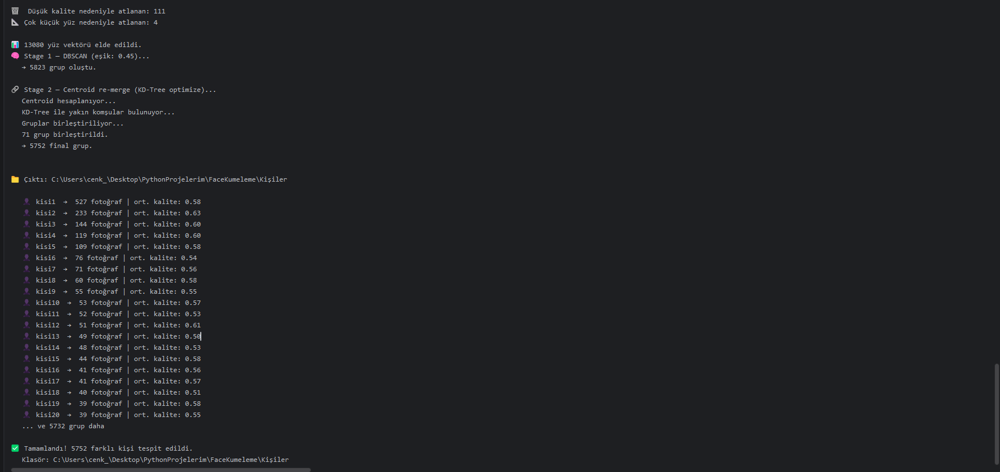
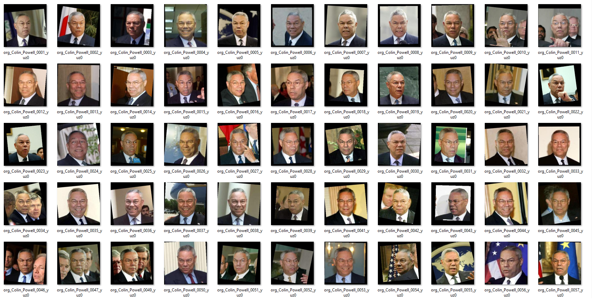

📖 [TÜRKÇE & ENGLISH ]

# Otomatik Yüz Tanıma ve Gruplandırma Sistemi

Bu proje, InsightFace ve DBSCAN kullanılarak geliştirilmiş, CUDA ile optimize edilmiş uçtan uca bir yüz kümeleme (face clustering) pipeline’ıdır.

---

## 📊 Veri Seti

- Labeled Faces in the Wild (LFW)
- 5.749 kişi
- 13.233 yüz görüntüsü

📥 Dataset:  
https://www.kaggle.com/datasets/jessicali9530/lfw-dataset?resource=download

---

🧠 InsightFace Nedir?

InsightFace, yüz tespiti ve yüz tanıma işlemleri için kullanılan kütüphanedir.
Bu projede fotoğraflardaki yüzleri bulmak ve her yüzü matematiksel bir temsil (embedding) haline getirerek karşılaştırılabilir hale getirmek için kullandım.

⚡ CUDA Nedir?

CUDA, NVIDIA ekran kartlarının işlem gücünü kullanarak hesaplamaları çok daha hızlı yapmayı sağlayan bir teknolojidir.
Bu projede CPU yerine GPU kullanarak yüz işleme ve karşılaştırma işlemlerini yaklaşık 50 kat hızlandırdım.

🧠 DBSCAN Nedir?

DBSCAN, veriler arasındaki benzerliğe bakarak otomatik olarak gruplar oluşturan bir kümeleme algoritmasıdır.
Bu projede yüzlerin matematiksel karşılıklarını (embedding) çıkarıp birbirleriyle karşılaştırarak aynı kişiye ait fotoğrafları otomatik olarak gruplayıp klasörler oluşturdum.
---

## 🔍 Sistem Akışı (Pipeline)

1. InsightFace ile yüz tespiti  
2. Akıllı yüz seçimi (boyut + merkez bazlı)  
3. Yüz filtreleme:
   - Düşük kaliteli yüzler (bulanıklık, ışık)
   - Çok küçük yüzler  
4. Yüzlerin matematiksel temsilini (embedding) çıkarma  
5. DBSCAN ile benzer yüzleri gruplayarak clustering  
6. Centroid re-merge ile cluster iyileştirme (KD-Tree optimize)  

---

## ⚙️ İşleme Sonuçları

- ❌ Düşük kalite nedeniyle atlanan: **111 yüz**  
- 📐 Çok küçük olduğu için atlanan: **4 yüz**  
- 📊 Toplam elde edilen embedding: **13.080**  

### 🧠 Kümeleme Sonuçları

- Stage 1 — DBSCAN:
  - **5.823 grup**

- Stage 2 — Centroid Re-merge:
  - **71 grup birleştirildi**
  - **5.752 final grup**

> Elde edilen grup sayısı, gerçek kişi sayısına (5.749) oldukça yakındır.

---

## 🎯 Çözdüğüm Problemler

### 🧍‍♂️ 1. Arka Plan Yüz Problemi

Bir fotoğrafta ana kişinin arkasında bulunan yüzler sistem tarafından ayrı kişiler gibi algılanıyordu.  
Bu problemi çözmek için yüzleri boyut, konum ve kalite kriterlerine göre değerlendirip sadece en doğru (ana) yüzü seçen bir filtreleme mekanizması geliştirdim.

---

### ⚡ 2. Performans Problemi

Başlangıçta sistem CPU üzerinde çalıştığı için oldukça yavaştı.  
GPU (CUDA) kullanarak işlem süresini ciddi şekilde düşürdüm.

Ayrıca tüm yüzleri birbirleriyle tek tek karşılaştırmak yerine daha verimli bir yaklaşım kullandım:

- Her yüzü önce sayısal bir vektöre (embedding) dönüştürdüm  
- Bu vektörler arasındaki benzerliği cosine similarity (veya distance) ile hesapladım  
- DBSCAN algoritması ile birbirine yakın (benzer) olan yüzleri aynı gruplara ayırdım  

Matematiksel olarak:
İki yüz arasındaki benzerlik, vektörler arasındaki açıya göre hesaplanır.  
Eğer iki vektör birbirine çok yakınsa (mesafe küçükse), bu yüzler aynı kişiye ait kabul edilir.

Daha sonra:

- Her grubun ortalama vektörünü (centroid) hesapladım  
- Grupları bu ortalamalara göre tekrar karşılaştırarak yanlış ayrılmış olanları birleştirdim  

Bu yaklaşım sayesinde:

- Tüm yüzleri tek tek karşılaştırmak yerine sadece benzer olanlarla işlem yaptım  
- Gereksiz milyonlarca karşılaştırmayı ortadan kaldırdım  
- Sistemi hem daha hızlı hem de daha doğru hale getirdim  
---

## 🧠 Temel Özellikler

- Akıllı yüz seçimi (sadece en büyük yüz değil)  
  → Bir fotoğraftaki tüm yüzleri almak yerine, boyut, konum (merkeze yakınlık) ve kalite kriterlerine göre en doğru yüzü seçer.  
  → Bu sayede arka plan veya alakasız yüzlerin sisteme girmesi engellenir.

- Yüz kalite skorlama (bulanıklık, ışık, boyut)  
  → Her yüz, netlik (blur), parlaklık (brightness) ve çözünürlük (boyut) açısından değerlendirilir.  
  → Düşük kaliteli yüzler otomatik olarak filtrelenir ve sistemin doğruluğu artırılır.

- Arka plan yüz filtreleme  
  → Çok küçük, kenarda kalan veya düşük kaliteli yüzler elenerek sadece ana kişi dikkate alınır.  
  → Bu sayede yanlış eşleşmelerin (false positives) önüne geçilir.

- Yüzlerin matematiksel temsilini çıkarma ve karşılaştırma  
  → Her yüz, yüksek boyutlu bir vektöre (embedding) dönüştürülür.  
  → Bu vektörler arasındaki benzerlik, cosine similarity kullanılarak ölçülür ve aynı kişiye ait yüzler belirlenir.

- KD-Tree ile optimize edilmiş cluster birleştirme  
  → Tüm grupları tek tek karşılaştırmak yerine, sadece birbirine en yakın olan gruplar hızlıca bulunur.  
  → Bu sayede büyük veri setlerinde ciddi performans kazanımı sağlanır.

- Büyük veri setleri için ölçeklenebilir yapı  
  → Sistem, binlerce yüz verisi üzerinde hem hızlı hem de stabil şekilde çalışacak şekilde optimize edilmiştir.  
  → Gereksiz karşılaştırmalar azaltılarak performans korunur.

---

## 🛠️ Kullanılan Teknolojiler

- Python  
- OpenCV  
- InsightFace  
- ONNX Runtime (CUDA)  
- Scikit-learn (DBSCAN, NearestNeighbors)  
- NumPy 

---

## 📸 Örnek Çıktılar

## 📎 Not

Sadece cluster sayısı doğruluğu garanti etmez; daha detaylı analiz için purity ve completeness gibi metrikler kullanılabilir.
------------------------------------------------------------------------------------------------------------------------------------------------------------------------
📖 ENGLISH

# Automatic Face Recognition and Clustering System

This project is an end-to-end face clustering pipeline developed using InsightFace and DBSCAN, optimized with CUDA.

📊 Dataset
Labeled Faces in the Wild (LFW)
5,749 people
13,233 face images

📥 Dataset:
https://www.kaggle.com/datasets/jessicali9530/lfw-dataset?resource=download

🧠 What is InsightFace?

InsightFace is a library used for face detection and face recognition tasks.
In this project, I used it to detect faces in images and convert each face into a mathematical representation (embedding) so they can be compared.

⚡ What is CUDA?

CUDA is a technology that enables much faster computations by utilizing the power of NVIDIA GPUs.
In this project, I accelerated face processing and comparison operations by approximately 50x by using GPU instead of CPU.

🧠 What is DBSCAN?

DBSCAN is a clustering algorithm that automatically forms groups based on similarity between data points.
In this project, I extracted mathematical representations (embeddings) of faces and compared them to automatically group photos belonging to the same person and organize them into folders.

🔍 System Pipeline
Face detection using InsightFace
Smart face selection (size + center-based)
Face filtering:
Low-quality faces (blur, lighting)
Very small faces
Extracting face embeddings
Clustering similar faces using DBSCAN
Cluster refinement with centroid re-merge (KD-Tree optimized)
⚙️ Processing Results
❌ Skipped due to low quality: 111 faces
📐 Skipped due to small size: 4 faces
📊 Total embeddings obtained: 13,080
🧠 Clustering Results
Stage 1 — DBSCAN:
5,823 clusters
Stage 2 — Centroid Re-merge:
71 clusters merged
5,752 final clusters

The resulting number of clusters is very close to the actual number of people (5,749).

🎯 Problems I Solved
🧍‍♂️ 1. Background Face Problem

Faces located behind the main subject in an image were being detected as separate individuals.
To solve this, I developed a filtering mechanism that evaluates faces based on size, position, and quality, selecting only the most relevant (main) face.

⚡ 2. Performance Problem

Initially, the system was running on CPU and was quite slow.
By using GPU (CUDA), I significantly reduced processing time.

Instead of comparing every face with every other face, I used a more efficient approach:

Converted each face into a numerical vector (embedding)
Calculated similarity between vectors using cosine similarity (or distance)
Grouped similar faces using the DBSCAN algorithm

Mathematically:
The similarity between two faces is calculated based on the angle between their vectors.
If two vectors are very close (small distance), those faces are considered to belong to the same person.

Then:

Computed the average vector (centroid) of each cluster
Compared clusters again based on these centroids and merged incorrectly separated ones

With this approach:

Avoided comparing all faces one by one
Eliminated millions of unnecessary comparisons
Made the system both faster and more accurate
🧠 Key Features
Smart face selection (not just the largest face)
→ Instead of selecting all faces in an image, the system selects the most relevant one based on size, position (proximity to center), and quality.
→ Prevents background or irrelevant faces from entering the system.
Face quality scoring (blur, brightness, size)
→ Each face is evaluated based on sharpness (blur), brightness, and resolution.
→ Low-quality faces are automatically filtered out, improving overall accuracy.
Background face filtering
→ Very small, edge-located, or low-quality faces are eliminated, keeping only the main subject.
→ Reduces false positives.
Face embedding extraction and comparison
→ Each face is converted into a high-dimensional vector (embedding).
→ Similarity between these vectors is measured using cosine similarity to identify faces belonging to the same person.
KD-Tree optimized cluster merging
→ Instead of comparing all clusters one by one, only the nearest clusters are efficiently identified.
→ Provides significant performance improvement on large datasets.
Scalable structure for large datasets
→ Optimized to work efficiently and stably on thousands of face images.
→ Reduces unnecessary computations while maintaining performance.
🛠️ Technologies Used
Python
OpenCV
InsightFace
ONNX Runtime (CUDA)
Scikit-learn (DBSCAN, NearestNeighbors)
NumPy

📸 Sample Outputs

📎 Note

Cluster count alone does not guarantee accuracy; for more detailed evaluation, metrics such as purity and completeness can be used.
